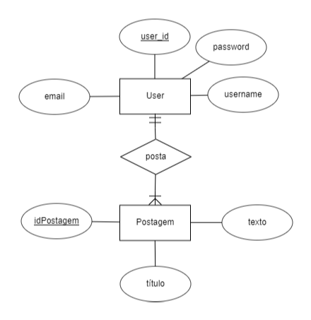

## Implementação uma API REST em que um usuário pode realizar um cadastro, publicar Posts e ver as publicações de outros usuários.

Para esta aplicação foi utilizado um banco de dados POSTGRESQL hospedado no ElephantSQL.
Para o diagrama de Entidade-Relacionamento, foi criado duas entidades: User e Postagem, na qual User possui as credenciais de um usuário e Postagem possui os dados para uma postagem.

Para a implementação desta API, foi utilizado python com django e django-rest-framework. 
